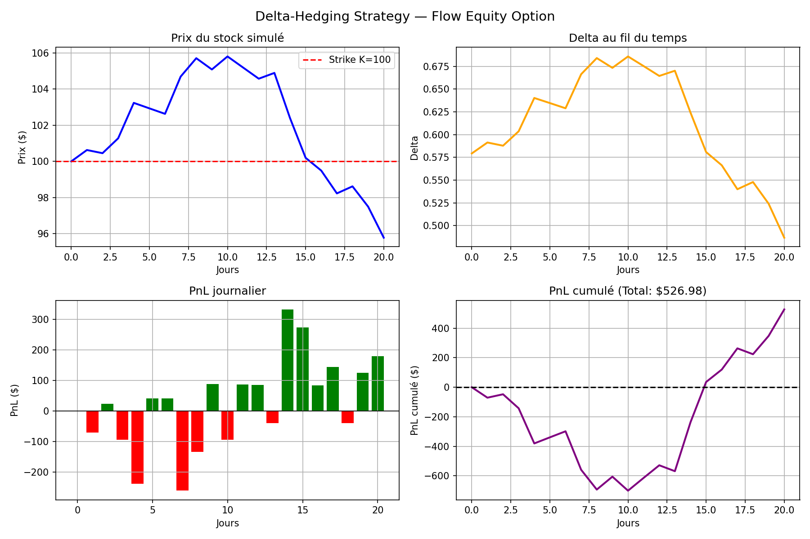

# 📈 Delta-Hedging Strategy — Flow Equity Option

Simulation d'une stratégie de delta-hedging dynamique sur 21 jours de trading,
développée dans le cadre d'un projet Finance de Marché (M1 ESLSCA Paris).

---

## 🎯 Contexte métier

En tant que flow trader ayant vendu un call ATM à un client institutionnel,
l'objectif est de neutraliser le risque directionnel du book en rééquilibrant
quotidiennement une position en actions proportionnelle au delta de l'option.
Ce projet simule ce processus sur 1 mois de trading et mesure l'efficacité
du hedge via l'attribution du PnL journalier.

---

## ✨ Fonctionnalités

- Simulation de trajectoires de prix par mouvement brownien géométrique (GBM)
- Calcul journalier des Greeks : Delta, Gamma, Vega via Black-Scholes
- Boucle de rééquilibrage dynamique du hedge sur 21 jours
- Attribution du PnL : variation option + gain/perte stock + intérêts cash
- Test de robustesse sous différents régimes de volatilité (σ=10%, 20%, 40%)

---

## 📸 Résultats

---

## 📊 Résultats — Simulation (seed=42)

| Métrique | Valeur |
|----------|--------|
| Prix initial | $100.00 |
| Prix final (jour 21) | $96.00 |
| PnL total | +$526.98 |
| PnL max journalier | +$326.00 |
| PnL min journalier | -$248.00 |

### Test de robustesse

| Volatilité | PnL total | PnL std (gamma drag) |
|------------|-----------|----------------------|
| σ=10% | -$303.15 | $93.48 |
| σ=20% | -$518.78 | $160.36 |
| σ=40% | -$184.23 | $316.63 |

**Observation clé :** le PnL std triple entre σ=10% et σ=40% — c'est le gamma drag,
le coût réel du rééquilibrage en marché agité.

---

## 📐 Modèle & Paramètres

Black-Scholes sans dividendes (q=0)

| Paramètre | Valeur |
|-----------|--------|
| S₀ | 100 |
| K (ATM) | 100 |
| σ | 20% |
| r | 2% |
| T | 1 an |
| Jours | 21 |
| Contrats | 100 |

**PnL journalier :**

PnL_t = -(C_t - C_{t-1}) + Δ_{t-1}(S_{t-1} - S_t) + r × cash × dt

- Variation de la valeur de l'option (short)
- Gain/perte sur la position en actions
- Intérêts sur le cash

---

## ⚠️ Limites

- Rééquilibrage discret (journalier) → coût de transaction non modélisé
- Black-Scholes suppose une vol constante → pas de smile de volatilité
- Pas de coûts de transaction — le bonus propose 0.1% par trade

---

## 🚀 Installation & Lancement

pip install numpy scipy matplotlib

python delta_hedging.py

---

## 🛠️ Technologies

Stack : Python | Black-Scholes | NumPy | SciPy | Matplotlib

---

## 👤 Auteur

**Sacha** — Étudiant M1 Finance, ESLSCA Paris  
Projet réalisé dans le cadre d'une démarche d'apprentissage de la finance de marché
